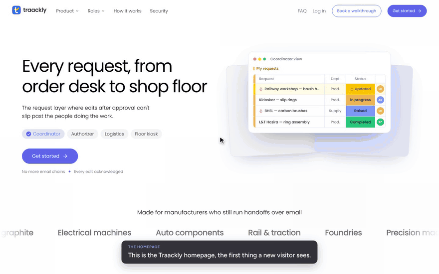
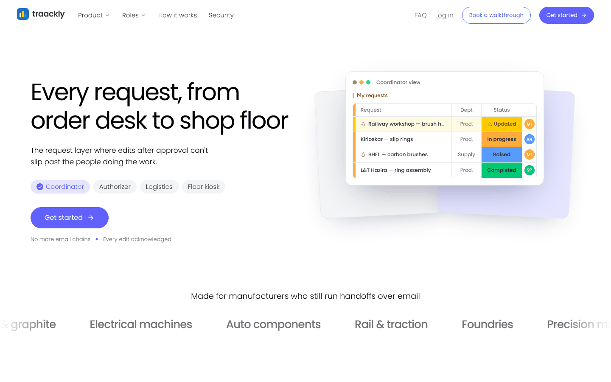
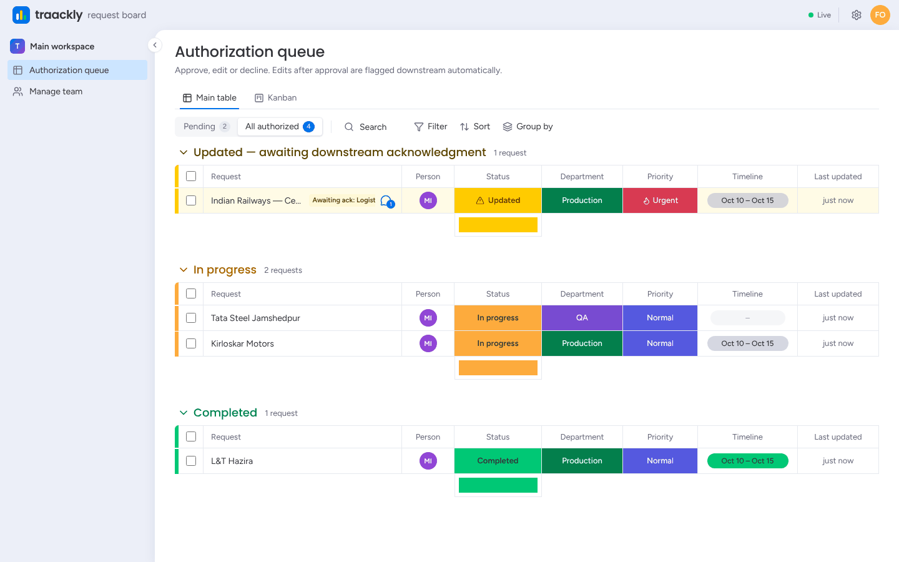
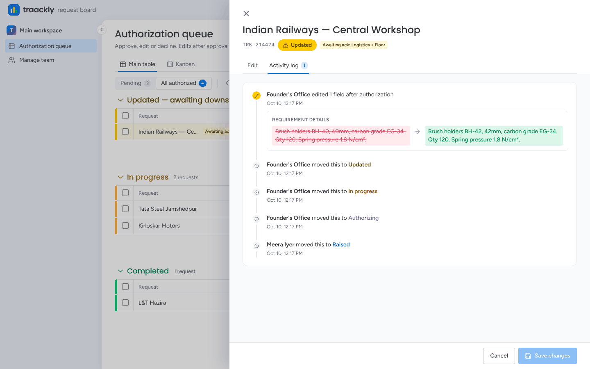
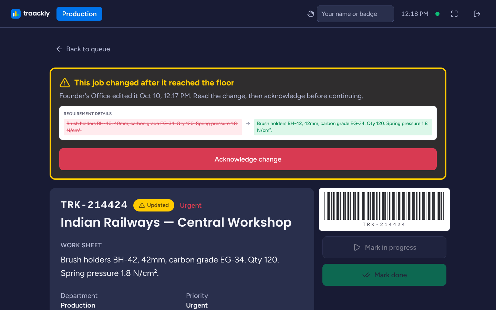

<div align="center">


# Traackly

**Every request, from order desk to shop floor.**

The request layer for manufacturers where an edit made after approval can't slip past the people doing the work.

[▶ Watch the walkthrough (5:53)](docs/media/traackly-walkthrough.mp4) · [How it works](#how-it-works) · [Run it locally](#run-it-locally)

<a href="docs/media/traackly-walkthrough.mp4"></a>

<sub>A 30-second preview. Click it for the full walkthrough with voice-over.</sub>

</div>

## What is Traackly?

In most small manufacturing businesses, an order travels from the order desk to approval, then to logistics, then to the shop floor, over email chains and phone calls. When someone changes the specification *after* it was approved, that change often never reaches the people building it, and the job gets made to the old spec.

Traackly replaces that email chain with one live board for each role, and enforces one rule:

> **Every edit made after approval must be acknowledged by whoever works on it next, before that work can continue.**

## How it works

1. **Raise.** A Coordinator raises a structured request: client, exact requirement, department and priority.
2. **Authorize.** An Authorizer approves it, corrects it, or declines it with a reason.
3. **Schedule.** Logistics sets an estimated completion date, and the job appears on that department's floor kiosk.
4. **Build.** The floor works from a shared kiosk screen: big type, big buttons and a barcode for every job. No individual logins.
5. **Change, then acknowledge.** If the Authorizer edits the request after approval, it turns **Updated**. Logistics and the floor are notified, *Mark done* stays locked until both have acknowledged, and every changed field is logged permanently with its old and new value.

| | |
|---|---|
| <br><sub>**The homepage.** What a new visitor sees first.</sub> | <br><sub>**Live boards.** Requests grouped by stage, with search, filters, sorting, group by, and a Kanban view.</sub> |
| <br><sub>**Nothing changes silently.** Every edit after approval is logged field by field.</sub> | <br><sub>**The floor kiosk.** A changed job is flagged, and *Mark done* is locked until someone acknowledges the change.</sub> |

### Who uses it

| Role | Lands on | Does |
|---|---|---|
| Coordinator | `/requests` | Raises requests and watches them update live |
| Authorizer | `/authorize` | Approves, declines and edits requests; manages the team and kiosk stations |
| Logistics | `/logistics` | Sets and revises execution timelines |
| Floor supervisor / kiosk | `/kiosk` | Works the department's job queue, acknowledges changes, marks jobs done |

### Why it holds up

- **Live everywhere.** Boards and kiosks update within about a second over WebSocket, with no refresh.
- **History can't be rewritten.** The change log is append-only at the database level.
- **No silent overwrites.** If two people edit at once, the second save is stopped and shown the latest version.
- **Built for the floor.** Shared station kiosks need no logins, and an acknowledgment tapped while offline syncs automatically when the connection returns.
- **Locked down.** Accounts are invite-only, every route checks the role on the server, and deactivating someone ends their sessions on their very next request.

---

# For developers

The UI follows monday.com's design language: colour-coded board groups, full-colour status cells, and a tinted canvas with a white working panel. The floor kiosk uses a separate dark, high-contrast mode with large touch targets.

## The core mechanic (PRD Story 3)

1. An Authorizer edits a request that has already been authorized.
2. The domain layer (`server/internal/domain/lifecycle.go` → `ApplyEdit`) appends one changelog entry per changed field, moves the request to **Updated**, and records who must acknowledge:
   - **Logistics** always, cleared by saving or re-confirming the timeline.
   - **The department floor**, if the job had already reached its kiosk, cleared by tapping *Acknowledge change*.
3. Until every pending acknowledgment is cleared, *Mark in progress* and *Mark done* are refused by the server (`409 blocked`), as well as disabled in the UI.
4. Downstream owners are notified by email, and every open screen updates over WebSocket within about a second.

Every write to an existing request goes through one function, `store.MutateRequest`. It applies the domain rule, does an `updatedAt` compare-and-swap (optimistic concurrency, App Flow §9), and persists changelog and status history with `$push` only, so history is append-only at the database operation level. No HTTP handler can bypass the gate. `TestNCBPIncidentEndToEnd` replays the PRD incident through the real API, and `TestChangelogIsAppendOnly` proves that a forged rewrite of history is not stored.

## Stack

- **Server** (`/server`): Go 1.26, chi, the official MongoDB driver v2, `coder/websocket`, JWT (HS256) over httpOnly `SameSite=Strict` cookies, bcrypt (cost 12).
- **Client** (`/client`): React 18 + TypeScript, Vite, Tailwind (design tokens as CSS variables), React Router, TanStack Query, Zod.
- **Data:** MongoDB with six collections (`users`, `sessions`, `station_tokens`, `requests`, `notifications`, `departments`) and every index from the Backend Schema doc.
- **Deploy:** one Docker image on Render, with MongoDB on Atlas.

## Run it locally

Prerequisites: Go 1.26+, Node 22+, and MongoDB 7+ on `localhost:27017`. To run the integration tests, start `mongod` with `--setParameter enableTestCommands=1`.

```bash
# 1. API + demo data
cd server
export JWT_SECRET=dev-secret-dev-secret-dev-secret-123 COOKIE_SECURE=false EXPOSE_DEV_LINKS=true
export SEED_AUTHORIZER_EMAIL=founder@traackly.demo SEED_AUTHORIZER_PASSWORD=traackly123
make seed-demo        # departments, bootstrap Authorizer, one user per role, requests in every state
make run              # http://localhost:8080

# 2. Client (separate terminal): proxies /api and /api/ws to :8080
cd client
npm install
npm run dev           # http://localhost:5173
```

Demo logins (password `traackly123`):

| Email | Role |
|---|---|
| `founder@traackly.demo` | Authorizer |
| `coordinator@traackly.demo` | Coordinator |
| `logistics@traackly.demo` | Logistics |
| `floor@traackly.demo` | Floor supervisor (Production) |

The demo data includes the NCBP railway order already edited after it reached the Production floor, so the kiosk shows it flagged.

To try the **shared-station kiosk** (no personal login), sign in as the Authorizer, open **Manage team → Kiosk stations → Provision**, and open the one-time link on another browser or device.

Without `RESEND_API_KEY`, emails (invites, resets, change notifications) are written to the server log. With `EXPOSE_DEV_LINKS=true`, invite and reset links are also shown in the UI. Every variable is documented in [`.env.example`](.env.example).

## Quality gates

```bash
cd server && make verify   # gofumpt, golangci-lint v2 (strict config), ASCII check, race tests,
                           # 95% coverage floor + ratchet, build
cd client && npm run lint && npm run typecheck && npm test && npm run build
```

- `server/.golangci.yml` is a strict golangci-lint v2 baseline. `server/arch_test.go` adds AST checks: no `os.Getenv` outside `config/`, no `panic`, a 300-line file cap, doc comments on exported identifiers, no raw SQL strings, complete JSON tags, no package-level mutable state, and no commented-out code.
- The integration tests run against a real MongoDB. They use `failCommand` fail points, scoped to the test's own connection and collection, to prove every database failure path fails closed with a generic 500.
- CI (`.github/workflows/ci.yml`) runs both gates on every pull request.

## Deploy (Render)

`render.yaml` defines two services from the same `Dockerfile`:

- **`traackly-staging`** auto-deploys from `develop`.
- **`traackly`** deploys from `main` only when promoted manually.

Set `MONGODB_URI` (Atlas), `APP_BASE_URL`, and optionally `RESEND_API_KEY` / `EMAIL_FROM` in each service. `JWT_SECRET` is generated by Render. Create the first Authorizer once from a Render shell:

```bash
SEED_AUTHORIZER_EMAIL=you@company.com SEED_AUTHORIZER_PASSWORD='…' /app/seed
```

## Where this build differs from the spec docs, and why

- **Backend language:** Go instead of Node/Express, at the project owner's request. The TRD's guarantees carry over unchanged: a deterministic core mechanic enforced below the HTTP layer, REST + WebSocket push, RBAC on every route, server-side sessions with real-time revocation, and station tokens for kiosks.
- **One Render web service instead of Static Site + Web Service:** `SameSite=Strict` session cookies (TRD §9) only work same-origin, so the API serves the built client.
- **Acknowledgment tracking:** `pendingAcks` (`logistics` / `floor`) is stored on the request, so the S-31 Logistics acknowledgment and the S-41 floor acknowledgment are tracked separately. `statusHistory`, `workStartedAt` and `completedAt` (from the TRD) are also stored. Invite and reset tokens are stored only as SHA-256 hashes on `users`.
- **Kiosk access:** the kiosk accepts either a department station token or a logged-in floor supervisor (App Flow S-40). Staff routes never accept station tokens.
- **At-risk flag:** the TRD §7 v1 heuristic (2+ post-authorization edits, or a change left unacknowledged past the department window: 48h, or 24h for QA) is computed when requests are read, not by a scheduled job. Results are identical, with no extra moving part.
- **Job IDs:** the barcode / product ID on job cards is a Code 39 rendering of the request's `TRK-XXXXXX` job code.
