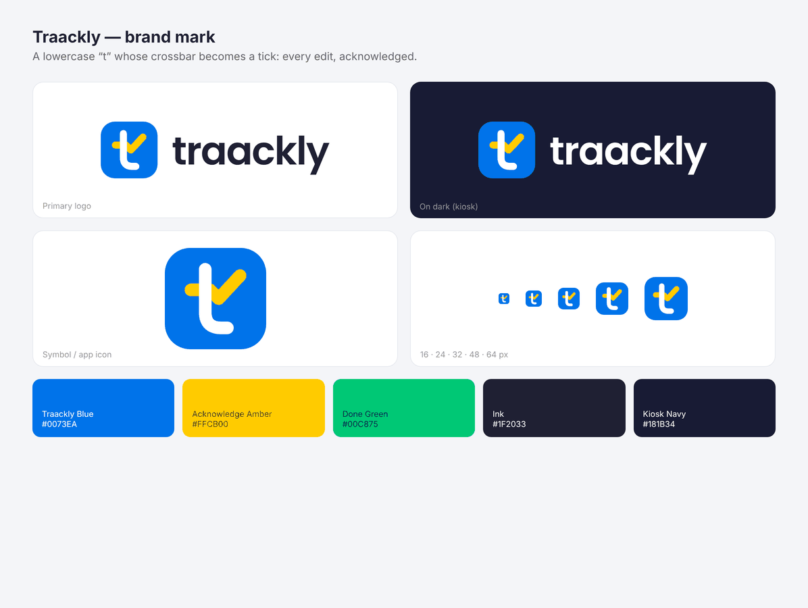

# Traackly brand

**The mark:** a lowercase “t” whose crossbar becomes a tick. It says the name and the product's one rule at the same time: every edit, acknowledged.

## Files

| File | Use it for |
|---|---|
| `traackly-logo.svg` / `.png` | Default logo on white or light backgrounds |
| `traackly-logo-on-dark.svg` / `.png` | Dark backgrounds, such as the floor kiosk |
| `traackly-mark.svg` | Symbol on its own: app icon, favicon, avatars |
| `traackly-mark-512.png`, `traackly-mark-1024.png` | App stores, social profiles, slides |

Use the SVGs wherever you can. The PNGs have transparent backgrounds. The wordmark is Poppins SemiBold converted to outlines, so it renders the same everywhere without the font installed.

## Colours

| Name | Hex | Role |
|---|---|---|
| Traackly Blue | `#0073EA` | Symbol tile, primary actions |
| Acknowledge Amber | `#FFCB00` | The tick; "changed, needs acknowledgment" in the app |
| Done Green | `#00C875` | Completed work |
| Ink | `#1F2033` | Wordmark and text on light backgrounds |
| Kiosk Navy | `#181B34` | Dark backgrounds |

## Do

- Keep clear space around the logo of at least half the symbol's width.
- Write the name in lowercase in the logo: **traackly** (two a's).

## Don't

- Recolour the tick, stretch the logo, or put the symbol on a busy photo.
- Use the symbol below 16 px.
